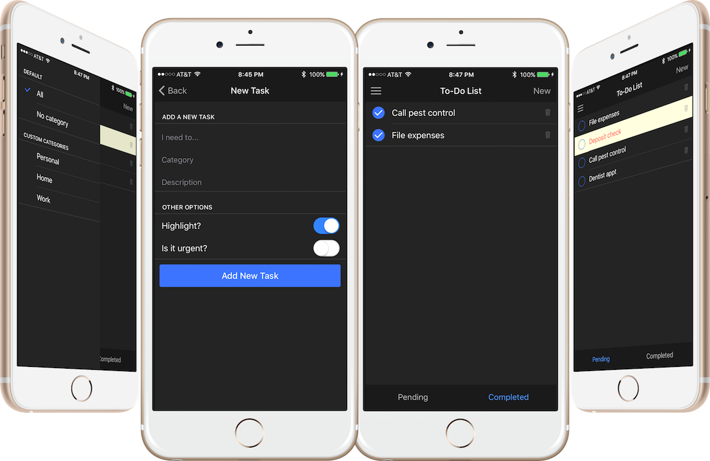

## PhoneGap PouchDB Sample Project 

## Introduction
>PouchDB is an open-source JavaScript database inspired by Apache CouchDB that is designed to run well within the browser.

>PouchDB was created to help web developers build applications that work as well offline as they do online.
It enables applications to store data locally while offline and then synchronize it with CouchDB compatible servers when the 
app is back online, allowing for a nice offline experience. [Related Slides](http://www.slideshare.net/HollySchinsky)

>This project is a sample Todo app using vanillaJS/Onsen UI with Cordova and PouchDB to show how to easily store and sync data with a remote
server. 

(Credit: Onsen UI Todo sample code)[https://github.com/frankdiox/OnsenUI-Todo-App}]   

Quick Start Setup
==================
1. Clone or download this repo 
2. Create a new PhoneGap or Cordova Project using the PhoneGap CLI or the PhoneGap Desktop App
         
	 `$ phonegap create PouchDBApp`

3. Copy in the `config.xml` file and `www` folder into the project created above
4. Serve the app from PhoneGap Desktop or the PhoneGap CLI from the root of your project

         $ phonegap serve  

**Note:** This project uses the following plugins: 
    - cordova-plugin-sqlite-2
    - cordova-plugin-network-information 
    - cordova-plugin-statusbar

General Setup
==================
*Use this setup to add PouchDB support and data sync to your existing apps...** 

1. Create a PhoneGap project using the PhoneGap Desktop app or the PhoneGap CLI

        $ phonegap create MyPouchDBApp
       
2. Open the new project from the root in your favorite editor

3. Download a version of `pouchdb.js` >= 6.0.0 from [here](https://github.com/pouchdb/pouchdb/releases) and include it in your `index.html`. *Be sure to include it **after** `cordova.js` to ensure you get the `deviceready` event.*

    	

4. Download the [pouchdb-adapter-cordova-sqlite](https://github.com/nolanlawson/pouchdb-adapter-cordova-sqlite) adapter bundle
from [here](https://unpkg.com/pouchdb-adapter-cordova-sqlite/dist/pouchdb.cordova-sqlite.js) and include it in your project under
`www/lib/pouchdb`

   Alternatively - use npm to install it... 

    `$ npm install pouchdb-adapter-cordova-sqlite`

    >This is a PouchDB adapter using either [Cordova-sqlite-storage](https://github.com/litehelpers/Cordova-sqlite-storage), 
    [cordova-plugin-sqlite-2](https://github.com/nolanlawson/cordova-plugin-sqlite-2) or [cordova-plugin-websql](https://www.npmjs.com/package/cordova-plugin-websql) 
    as its data store, depending on the device it's running from.

    >As long as there is a global `cordova.sqlitePlugin` (or `openDatabase`) available, this adapter should work. The 
    name of the adapter for database init is *`cordova-sqlite`*.        

5. Reference the PouchDB SQlite adapter in the `index.html`

     ``

4. Add at least one of the SQlite plugins to your project to support the above:
  - [cordova-plugin-sqlite-2](https://github.com/nolanlawson/cordova-plugin-sqlite-2)    
  - [Cordova-sqlite-storage](https://github.com/litehelpers/Cordova-sqlite-storage)
  - [cordova-plugin-websql](https://www.npmjs.com/package/cordova-plugin-websql)
    

6. Create a new local database after the `deviceready` event is fired

        document.addEventListener('deviceready', function () {
            // Setup PouchDB only on device ready
            PouchDB.plugin(PouchAdapterCordovaSqlite);
    
            // If mobile platform, you may want to use SQlite 
            if (ons.platform.isIOS() || ons.platform.isAndroid())
                myApp.db = new PouchDB('tasks.db', {adapter: 'cordova-sqlite'});
            else myApp.db = new PouchDB('tasks.db');                          
        };

7. Set up a remote database in the `deviceready` event handler
    ## PouchDB Server
    [pouchdb-server](https://github.com/pouchdb/pouchdb-server) is a simple Node.js server that presents a simple REST API, which mimics that of CouchDB, on top of PouchDB

        $ npm install -g pouchdb-server
        $ pouchdb-server -p 5984
        
 **Output**
 hschinsk-osx:OfflineFirst hschinsk$ pouchdb-server -p 5984
 [info] pouchdb-server has started on http://127.0.0.1:5984/
 [info] navigate to http://127.0.0.1:5984/_utils for the Fauxton UI.
 [info] GET / 200 - 127.0.0.1

        // Create the remote database to sync to 
        myApp.remoteDB = new PouchDB("http://localhost:5984/tasks");

8. Start bidirectional replication by calling sync        
            
            myApp.db.sync(myApp.remoteDB, {
				live: true,
				retry: true
			}).on('change', function (change) {
				console.log("A db change occurred " + JSON.stringify(change));				
			}).on('paused', function () {
				console.log("Replication paused");				
			}).on('active', function (info) {
				console.log("Replication resumed " + info);				
			}).on('error', function (err) {
				console.log("Sync Error occurred " + err);				
			})

9. Add API calls (see the www/js/services.js file for example calls)
10. Serve the app from PhoneGap Desktop or the PhoneGap CLI from the root of your project

         $ phonegap serve

11. Open your browser to the IP address returned from serve and start testing
12. Alternatively, add a mobile platform and test on your device or simulator
        

### Resources
- [PouchDB Inspector](https://chrome.google.com/webstore/detail/pouchdb-inspector/hbhhpaojmpfimakffndmpmpndcmonkfa)
- [PouchDB + PhoneGap](https://github.com/pouchdb/pouchdb/wiki/PouchDB-on-Phonegap)
- [PouchDB PhoneGap Cordova Notes](https://github.com/nolanlawson/pouchdb-phonegap-cordova)
- [pouchdb-server](https://github.com/pouchdb/pouchdb-server) 
- [CouchDB](http://couchdb.apache.org/)
- [Couchbase](http://www.couchbase.com/)
- [Cloudant](http://cloudant.com)